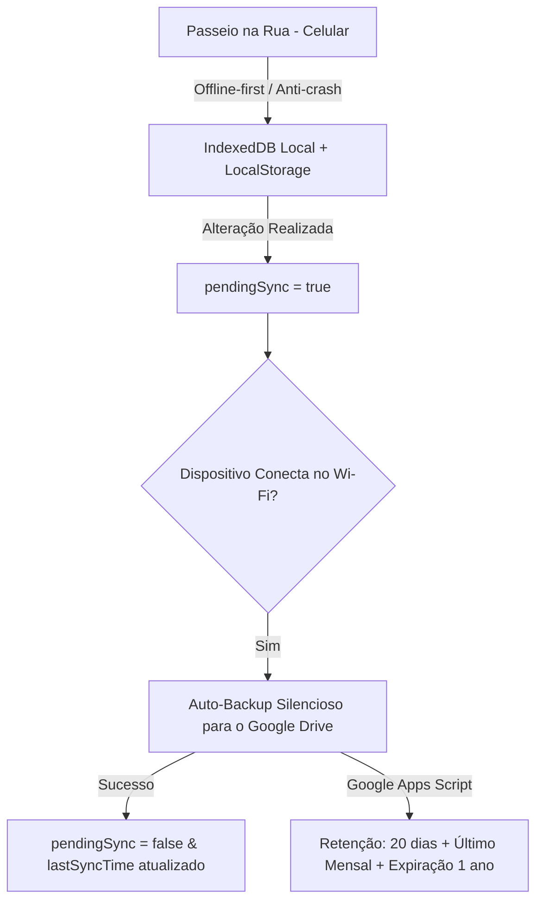

# Glossário de Domínio & Arquitetura - Petwalker

Este documento define a linguagem ubíqua (*Ubiquitous Language*) e as regras operacionais do sistema **Petwalker PWA**.

---

## 🏛️ Entidades Principais

### 1. Tutor (Cliente / Responsável)
Pessoa ou família responsável por um ou mais Pets. É a entidade financeira a quem as Faturas Mensais são destinadas.
- **Campos**: `id`, `name`, `phone`, `email`.

### 2. Pet
Animal de estimação associado a um Tutor e Grupo.
- **Campos**: `id`, `groupId`, `name`, `breed`.

### 3. Grupo de Passeio (Contrato de Passeio)
Agrupamento de um ou mais Pets do mesmo Tutor que passeiam juntos em uma mesma sessão de horário. O valor do passeio é negociado por **Horário/Sessão** (e não por pet individual).
- **Valores Contratados**:
  - `rate30min`: Valor da sessão de 30 minutos (ex: R$ 40,00).
  - `rate60min`: Valor da sessão de 60 minutos (ex: R$ 70,00).

### 4. Sessão de Passeio (Walk Session)
Registro operacional de um passeio realizado.
- **Dados Temporais**: `date`, `startTime`, `endTime`.
- **Duração Contratada**: 30 ou 60 minutos (usada para cálculo financeiro).
- **Custo Histórico Congelado (`cost`)**: Gravado no momento da conclusão para que reajustes futuros de preços não alterem faturas de meses anteriores.
- **Quilometragem Opcional**: `kmStart`, `kmEnd`, `kmTotal` para passeios realizados de carro.
- **Registro Fotográfico (`photo`)**: Imagem comprimida em Base64 (WebP/Canvas) para exibição e histórico.
- **Anotações**: Necessidades fisiológicas (xixi, cocô, água, cansaço) e notas livres.

### 5. Fatura Mensal (Monthly Invoice)
Consolidação financeira mensal gerada para um Tutor.
- **Período**: Mês/Ano de referência (`YYYY-MM`).
- **Itens de Passeio**: Lista de Sessões do mês × Custo Gravado.
- **Ajustes**: Soma de Créditos (-), Débitos extras (+) e Descontos.
- **Total a Pagar**: Valor líquido apurado com dados PIX do prestador.

### 6. Ajuste Financeiro (Financial Adjustment)
Lançamento avulso atrelado a um Tutor para compensação na fatura mensal.
- **Tipos**: `credit` (abatimento), `debit` (serviço extra como banho), `discount`.

---

## 🔄 Fluxo Operacional & Sincronização em Nuvem

1. **Passeio na Rua (Celular)**: Funciona 100% offline. O cronômetro ativo possui cópia no `localStorage` para proteção contra reinicializações ou fechamento de abas.
2. **Sincronização Automática Inteligente**: Ao detectar conexão Wi-Fi (ou foco do app) com alterações pendentes, o snapshot é enviado em segundo plano para a pasta `Petwalker_Backups` no Google Drive.
3. **Gestão e Fechamento no Computador**: Ao abrir o PWA no notebook ou outro dispositivo, a restauração da versão mais recente ou histórica consolida os dados sem conflitos.
